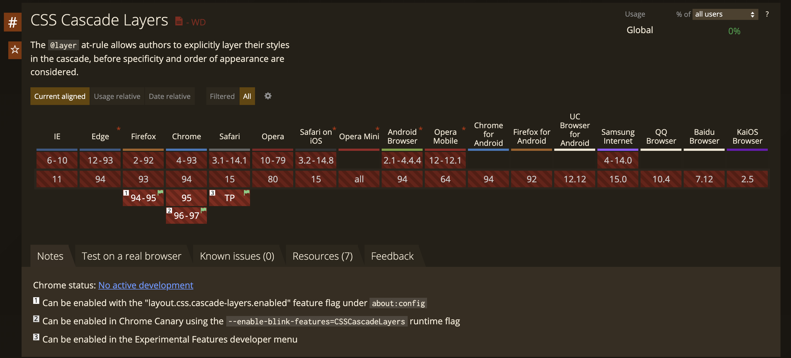

# CSS Layers

## To understand CSS layers we need to understand:
- CSS cascade
- To determine the style which is going to be applied CSS cascade looks at
  multiple things:
    1. Origin and Importance - highest precedence
    2. Context
    3. Style Attribute
    4. Specificity
    5. Order of Appearance - lowest precedence
- [Nice article to learn CSS cascade](https://wattenberger.com/blog/css-cascade)
- In the day-to-day Frontend developer life we mostly play with
    - Specificity (not simple)
    - Order of appearance (simple)
- So here is a nice illustration to learn CSS specificity, [source](https://stuffandnonsense.co.uk/archives/css_specificity_wars.html):

- Here is a small puzzle:
```css
/*
    <input type="password" id="password" style="color: blue;" />
*/
input {
    color: grey;
}

input[type="password"] {
    color: hotpink !important;
}

#password {
    color: lime;
}

/*
    - Which color is going to be applied to the input?
        1. blue (inline)
        2. grey
        3. hotpink
        4. lime
        5. black (user-agent default)
    * See answer at the very end
*/
```

## Problem when dealing with Specificity and Order of appearance
- High specificity statements can cause problems if you want to override them.
  High specificity may lead to an increased usage of `!important`, which will
  lead to even more problems with overriding later on
- Low specificity statements can be overridden too easily later in the code,
  especially when you plug in some 3rd party library code

## Existing solutions to the above mentioned problems
- Existing methodologies that solve the problems with Specificty:
    - **BEM** - Block, Element, Modifier
    - **ITCSS** - Inverted Triangle CSS
    - **OOCSS** - Object Oriented CSS
- All methodologies suggest
    - structuring CSS code in some logical manner
        - by creating hierarchies/layers
    - keeping specificity low by predominantly using classes
        - i.e. hierarchies/layers are implemented by means of classes mostly
- These methodologies help but there are still problems with them:
    - None of the methodologies can enforce their own order of appearance
    - Specificity still prevails over the order of layers which methodologies
      create
      
## New native solution to the Specificity and Order of appearance problems
- CSS Layers

## What are CSS layers?
- CSS Layers are part of the [CSS Cascading and Inheritance Level 5 specification](https://www.w3.org/TR/css-cascade-5/)
- CSS Layers development is led by [Miriam Suzanne](https://twitter.com/TerribleMia/)
- CSS Layers give more control over the cascade
- CSS Layers work similarly to CSS Style Origins but WITHIN SINGLE STYLE ORIGIN
    - FYI: CSS Style Origins are:
        - `author` - a developer (highest precedence in most cases)
        - `user` - meaning the user of the browser, so e.g. styles applied from
          the dev tools or browser extensions (lower precedence than `author`)
        - `user-agent` - default browser styles (lowest precedence)
- CSS Layers are expressed with the `@layer {...}` rule

## How to create a cascade layer?
```css
/* 1st option */
@layer reset {
  * { /* Poor Man's Reset */
    margin: 0;
    padding: 0;
  }
}

/* 2nd option */
@layer reset;

/* 3rd option */
@import(reset.css) layer(reset);

/* There might be a 4th option with an attribute on the <link>
    - https://github.com/w3c/csswg-drafts/issues/5853
*/
```

## CSS Layers order
- Cascade layer are sorted in the declaration order, e.g.:
```css
/* Create 1st layer named “reset” */
@layer reset {
  * {
    margin: 0;
    padding: 0;
  }
}

/* Create 2nd layer named “base” */
@layer base {
    /* ... */
}

/* Create 3rd layer named “theme” */
@layer theme {
    /* ... */
}

/* Create 4th layer named “utilities” */
@layer utilities {
    /* ... */
}

/*
- PAY ATTENTION:
    - we define the base layer one more time here
    - this will append the styles to an existing layer named “base”
    - the ORDER of the base layer is still 2
*/
@layer base {
    …
}

/*
- So the declaration order of CSS layer is:
    1. reset
    2. base
    3. theme
    4. utilities
*/
```
- So since the declaration order for CSS Layers is always preserved, we can do:
```css
@layer reset;     /* Create 1st layer named “reset” */
@layer base;      /* Create 2nd layer named “base” */
@layer theme;     /* Create 3rd layer named “theme” */
@layer utilities; /* Create 4th layer named “utilities” */

@layer reset {
    /* ... */
}

@layer theme {
    /* ... */
}

@layer base {
    /* ... */
}

@layer theme {
    /* ... */
}
```
- Or you can (actually it is a BEST PRACTICE) declare your layers in one line:
```css
@layer reset, base, theme, utilities;

/*
- "utilities" wins over all other layers
- "theme" wins over "base", "reset" and "unlayered styles"
- "base" wins over "reset" and "unlayered styles"
- "reset" wins over "unlayered styles"
*/
```

## CSS Layers and Cascade
- CSS Layers have a higher precedence than Specificity and Order of appearance:
    1. Origin and Importance - highest precedence
    2. Context
    3. Style Attribute
    4. **Layers** (more important than Specificity and Order of Appearance)
    5. Specificity
    6. Order of Appearance - lowest precedence

## CSS Layers examples
```css
@import(reset.css) layer(reset); /* 1st layer */

@layer base { /* 2nd layer */
  form input {
    font-size: inherit; 
  }
}

@layer theme { /* 3rd layer */
  input {
    font-size: 2rem;
  }
}

/*
- "input" selector has specificity 0,0,1
- "form input" selector has specificity 0,0,2
- BUT the "input" selector will win because the "theme" layer comes after the
"base" and hence wins
*/
```

## Important to note
- Unlayered styles come first in the Layer Order
    - i.e. unlayered styles have the LOWEST PRECEDENCE in comparison to all
      other layers
- Naming a layer is optional, it can look like `@layer { ... }`
    - Disadvantage of NOT naming a layer: you can't append styles to this layer
- Layers can be nested
```css
@layer base {}

@layer framework {
    @layer base {}

    @layer theme {}
}
```
- The use of `!important` is REVERSE
```css
@layer reset, base, theme, utilities;

/*
- `!important` in "unlayered styles" wins over "reset", "base", "theme" and "utilities"
- `!important` in "reset" wins over "base", "theme", "utilities"
- `!important` in "base" wins over "theme" and "utilities" 
- `!important` in "theme" wins over "utilities"
*/
```
- CSS Layers and Media queries work as you would expect
- `@keyframes`, `@scroll-timeline` and `@font-face` follow Layer Order
- No Interleaving of `@import`/`@namespace` and `@layer`
```css
/*
- From the moment the CSS parser sees a `@layer` that follows an earlier
`@import`, all subsequent `@import` rules after it will be ignored
 */

@layer default;
@import url(theme.css) layer(theme);
@layer components; /* 👈 This @layer statement here which comes after the @import above … */
@import url(default.css) layer(default); /* ❗️ … will make this @import rule (and any other that follow) be ignored. */
@layer default {
  audio[controls] {
    display: block;
  }
}

/* FIX: group your @import rules together */
@layer default;
@import url(theme.css) layer(theme);
@import url(default.css) layer(default);

@layer components;
@layer default {
    audio[controls] {
        display: block;
    }
}
```

## CSS Layers Support


## Sources
- CSS Layers [source article](https://www.bram.us/2021/09/15/the-future-of-css-cascade-layers-css-at-layer/)

## Answer for the puzzle
- `hotpink` because the `!important` rule wins over all other style declarations
